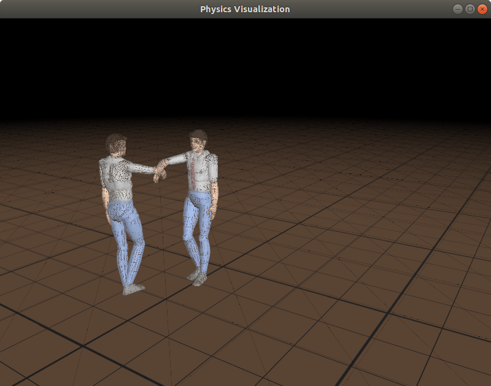
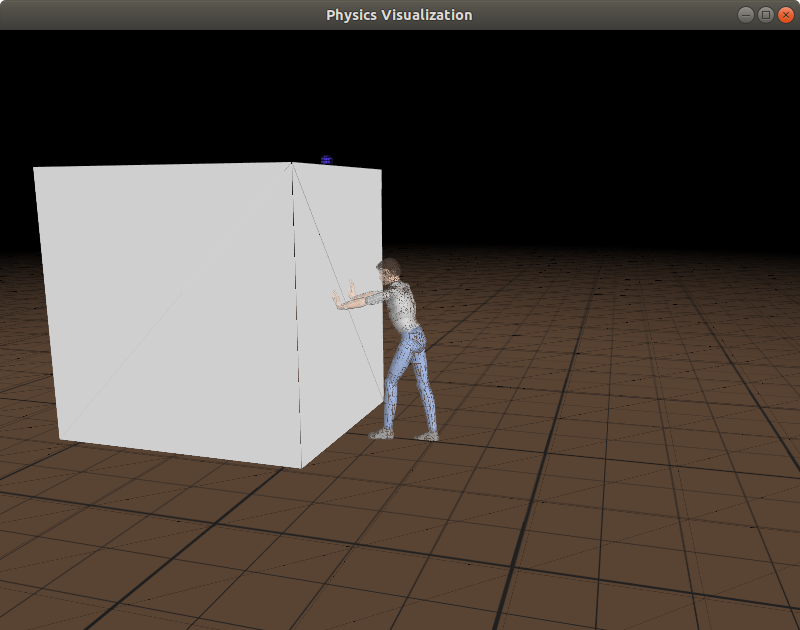

# README #

 <!-- allowed_elements ["<div>", "", "<br>"] -->

 <div margin="0px" align="left"><br>

 | Cartwheel - Handshake Between Two Human Characters | Cartwheel - Human Character Pushing Large Box  |
 | -------------------------------------------------- | ---------------------------------------------- |
 |  |  |
 | interactControl | interactControl_Push |

 </div><br>

Information presented herein provides the minimal instructions to build Cartwheel shared library and executables, and run the `interactControl` program for [**UA-Cartwheel**](https://code.google.com/archive/p/ua-cartwheel/); University of Arizona (UA) modified version of [**Cartwheel 3D**](https://code.google.com/archive/p/cartwheel-3d/) developed by the character animation group at University of British Columbia (UBC). Refer to [Cartwheel_Readme](./Cartwheel_Readme.md) file for a more detailed explanation of other `./Demos/interactControl_*.exe` exectuables demonstrating Cartwheel character animation motion control capabilities.

## Build and Run ##

To build the shared library and executables, run:

````shell
    make all
````

To run the `interactControl` program from within top-level `./ua-cartwheel` folder, add `./lib` folder containing Cartwheel shared library file (`libcartwheel.so`) to the LD_LIBRARY_PATH enviroment variable and invoke `interactControl` executable binary file located in `./bin` folder with following shell command sequence:

````shell
    LD_LIBRARY_PATH=./lib:$LD_LIBRARY_PATH
    ./bin/interactControl
````

Setting the LD_LIBRARY_PATH environment variable need only be done once during a command shell terminal session before running the `interactControl` program or any derivative demonstration programs.

The `interactControl` program provides an operational example of concurrent visualization and interative motion control of two animated characters in a simulated physical environment utilizing [Open Dynamics Engine](http://www.ode.org/) (ODE) for rigid body dynamics and OpenGL for 3D rendering. In addition to the aforementioned interactive control demonstration programs described in [Cartwheel_Readme](./Cartwheel_Readme.md), other program executables are listed below.

- `interface` - Example using Cartwheel simulation interface to render motion control animation and subsequently output captured character position state trajectory data.
- `mainControl` - Unfinished attempt to model behaviour control for static walk near policy enhanced actions. This is work in progress and currently does not properly handle SimBiController joint states with the BehaviourController. Specifically, the BehaviourController::setElbowAngles() method expects trajectory component data for elbow joints having three axes of rotation (i.e., a ball and socket joint), where as the SimBiController handles elbow joimts with only one axis of rotation (i.e., a hinge joint).
- `tomsLogger` - Test of RSS error between recorded position state trajectory data?

## Library Dependencies ##

(Partial List of) library dependencies in order to build the Cartwheel shared library and executables:

- Open Graphics Library (OpenGL): libgl1, libgl-dev
- OpenGL Utility Library (GLU): libglu1-mesa, libglu1-mesa-dev
- OpenGL Utility Toolkit (GLUT): freeglut3, freeglut3-dev
- OpenGL Extension Wrangler Library (GLEW): libglew2.0, libglew-dev
- Open Dynamics Engine (ODE): libode6, libode-dev
- GNU Scientific Library (GSL): libgsl23, libgsl-dev
- Basic Linear Algebra Subprograms (BLAS): libgslcblas0

Notes:

1. Library versions specified in the above list correspond to a Linux OS platform running an Ubuntu 18.04 LTS release desktop image on which **UA-Cartwheel** successfully compiles, links and executes.
2. OpenGL libraries may be specific to the integrated and/or discrete graphics drivers installed on a platform.

## Folder Contents ##

In the list below, names beginning with `./` indicate a folder, and those within parenthesis exist only in the workspace clone or copy of the ``ua-cartwheel`` repository.

- `./.vscode` - Visual Studio Code IDE launch, settings and tasks JSON scripts to build, debug and run Cartwheel components from within the VS Code IDE
- `(./bin)` - built Cartwheel non-demos executable files (workspace only folder)
- `./data` - animated motion control modeling and visualization asset files
- `./Demos` - interactControl animation demos source code and built executable files
- `./docs` - Cartwheel documentation files
- `(./docs/html)` - HTML browsable source code documentation generated by **Doyxgen** using `doxyconf` file
- `(./Examples)` - legacy interactControl animation examples (not included yet)
- `./include` - Cartwheel shared library source code header files
- `(./lib)` - built Cartwheel shared library file (workspace only folder)
- `./src` - source code for Cartwheel library and executables
- `CartWheel_Readme` - description of interactControl animation demos
- `doxyconf` - **Doxygen** program configuration file
- `LICENSE-2.0.txt` - Apache License, Version 2.0 text file
- `Makefile` - **make** utility script file for building Cartwheel library and executables
- `run_demo` - shell script file to run a named `interactControl` demonstration program
- `README.md` - this file

## Source Links ##

The source files provided in this repository were copied from the GitHub repository at source link \[[1](https://github.com/ninod2014/ua-cartwheel)], which was exported from the now archived Google Code web pages for the **UA-Cartwheel** project at source link \[[2](https://code.google.com/archive/p/ua-cartwheel/)], which in turn had been derived from the original **Cartwheel 3D** project still available at source link \[[3](https://code.google.com/archive/p/cartwheel-3d/)]. The **Cartwheel 3D** project evolved from the **Simbicon** project documented at source link \[[4](https://www.cs.ubc.ca/~van/papers/Simbicon.htm)].

\[[1](https://github.com/ninod2014/ua-cartwheel)] <https://github.com/ninod2014/ua-cartwheel>

\[[2](https://code.google.com/archive/p/ua-cartwheel/)] <https://code.google.com/archive/p/ua-cartwheel/>

\[[3](https://code.google.com/archive/p/cartwheel-3d/)] <https://code.google.com/archive/p/cartwheel-3d/>

\[[4](https://www.cs.ubc.ca/~van/papers/Simbicon.htm)] <https://www.cs.ubc.ca/~van/papers/Simbicon.htm>
